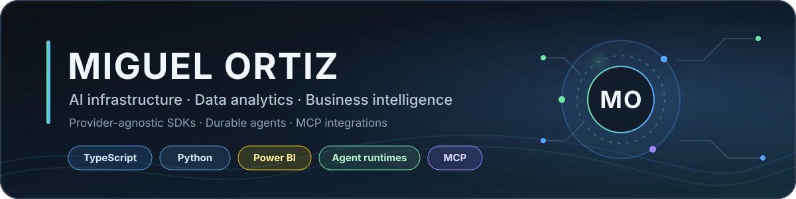

  

I build the infrastructure behind production AI applications and turn complex
data into reliable decision tools: provider-agnostic SDKs, durable agent
runtimes, analytics, and business intelligence dashboards.

My work focuses on making AI systems portable, observable, and reliable across
providers. I currently contribute to the
[Zhivex](https://github.com/Zhivex) ecosystem for TypeScript and Python.

## Languages & tools

  

## Data analytics & business intelligence

Alongside my open-source engineering work, I have delivered data analysis and
Power BI dashboards for teams in the banking sector. This work includes data
modeling, SQL, Power Query, DAX, KPI design, data quality, and executive and
operational reporting.

The source files, datasets, screenshots, client details, and internal metrics
are confidential, so I present the capabilities and methods rather than the
artifacts.

## Selected work

| Project | Language | Focus | Package |
| --- | :---: | --- | :---: |
| [Zhivex AI SDK](https://github.com/Zhivex/zhivex-ai-sdk) | TypeScript | Generation, streaming, tools, multimodal AI, provider routing, and durable agents | [npm](https://www.npmjs.com/package/@zhivex-ai/sdk) |
| [Zhivex AI SDK for Python](https://github.com/Zhivex/zhivex-ai-sdk-py) | Python | Async multi-provider systems, durable state, approvals, safety, tracing, and workflows | [PyPI](https://pypi.org/project/zhivex-ai-sdk/) |
| [MCP BCRA](https://github.com/mortiz-dev/mcp-bcra) | TypeScript | Typed MCP access to official financial and banking APIs from Argentina's Central Bank | [Repo](https://github.com/mortiz-dev/mcp-bcra) |

The two Zhivex SDKs expose a consistent multi-provider model while preserving
provider-native capabilities. MCP BCRA applies the same reliability principles
to a focused, public-data integration.

## Current focus

- Portable agent runtimes with tools, handoffs, approvals, and durable state
- Multi-provider model contracts and explicit native capabilities
- Streaming, structured output, observability, evaluations, and safety
- Data modeling, KPI design, and decision-ready Power BI dashboards
- MCP integrations that turn external APIs into dependable agent tools
- Release engineering and installed-package validation for SDKs

## About

Based in Buenos Aires, Argentina. I work in English and Spanish.

[Zhivex website](https://www.zhivex.com) ·
[Open-source projects](https://github.com/Zhivex)
